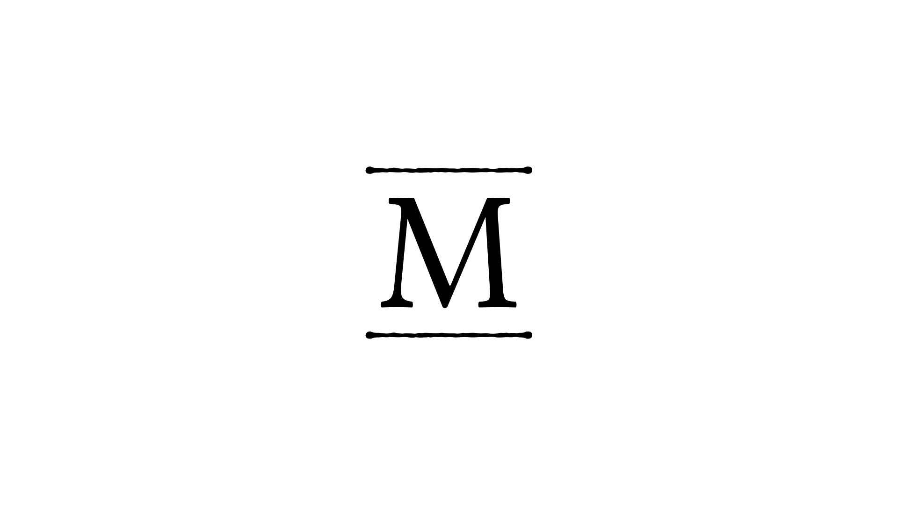

# modulus



Building an SMT solver from the ground up

## Introduction

SMT solvers are magical tools that are massively used in various domains of Computer Science & especially in formal verification. This magic comes at a price : SMT solvers are incredibly complex creatures. This can be explained for 3 principal reasons :
1. Writing a solver (in general) is incredibly hard because their principal purpose  is to provide a generic way to solve difficult problems
2. SMT solvers are capable to deal with a lot of rich theories & are thereby composed of many domain-specific solvers which theme-selfs are hard to develop.
3. Assemble all the components required to build a SMT is a real software engineering challenge

Modulus is an attempt at developing a tiny SMT in OCaml from scratch with no dependencies other than the OCaml standard library. It requires many components amon which :

+ A **SAT** solver which is the core of the solver used to guide the resolution by enumerating potential boolean models
+ Various domain specific solvers to decide theories such as **LIA**, **EUF** or **FP**

## Disclaimer

Modulus is not indented to be an efficient nor complete solver. It is designed to be an educative project and I'm pretty sure it will be very bad once fully developed (even reaching a quarter of the State of the Art would be a dead end).

## Following the development process

More information can be found on [Modulus website](https://jdrprod.github.io/modulus)


## Compiling the project

To compile the project, the only requirement is to have a valid [OCaml](https://ocaml.org) installation with [dune](https://dune.build).

### build

```
dune build
```

### test

```
dune exec -- test
```
